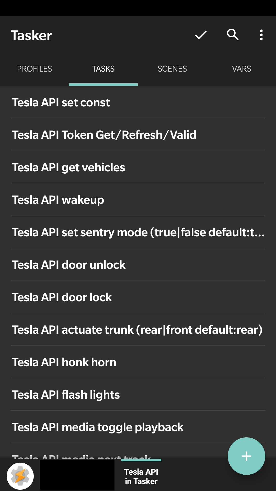
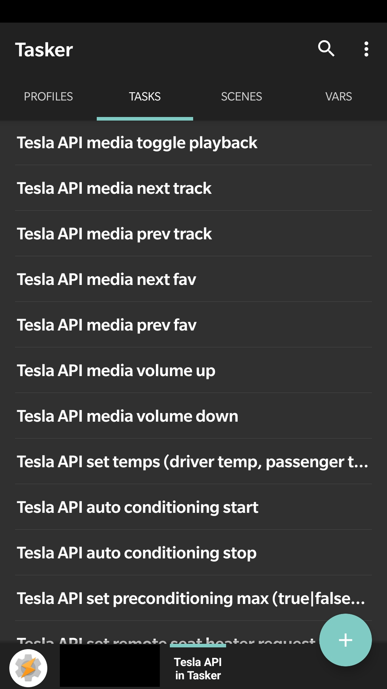
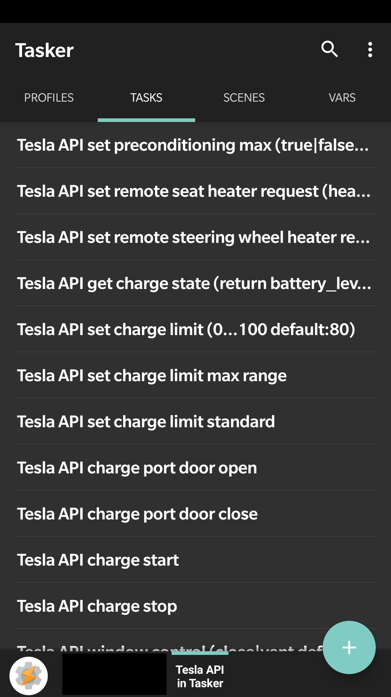

# Tesla API in Tasker

Access the Tesla API in Tasker (Android App)

This is a [Tasker](https://play.google.com/store/apps/details?id=net.dinglisch.android.taskerm) Profile to access the [unofficial Tesla API](https://tesla-api.timdorr.com/).

The idea was born during discussing a [feature request](https://github.com/adriankumpf/teslamate/issues/156) for [TeslaMate](https://github.com/adriankumpf/teslamate)

## Screenshots

  
  
  
  

## Table of contents

- [Tesla API in Tasker](#tesla-api-in-tasker)
  - [Screenshots](#screenshots)
  - [Table of contents](#table-of-contents)
  - [Security](#security)
  - [Features](#features)
  - [Dependencies](#dependencies)
  - [Installation](#installation)
  - [Update](#update)
  - [Usage](#usage)
  - [Contributing](#contributing)
  - [Donation](#donation)
  - [Disclaimer](#disclaimer)

## Security

Why not using [Tasker Plugin for Tesla](https://play.google.com/store/apps/details?id=com.crazydog.teslatasker)? You never know what a closed source application will do with your credentials :-)

So this Project is different.
Access token is generated: asked for Tesla account data with Tasker scene, store data only in local variable to get access token from Tesla and than destroy local copy of access data.

Token will be refreshed when expires in 10 or less days.

## Features

- [x] Token get/refresh (OAuth)
- [x] get vehicles
- [ ] get vehicle
- [x] wake up
- [x] set sentry mode (true|false default:true)
- [x] door unlock
- [x] door lock
- [x] actuate trunk (rear|front default:rear)
- [x] honk horn
- [x] flash lights
- [x] media toggle playback
- [x] media next track
- [x] media prev track
- [x] media next fav
- [x] media prev fav
- [x] media volume up
- [x] media volume down
- [ ] sharing
- [ ] get climate state
- [x] set temps (driver temp, passenger temp default:20.5)
- [x] auto conditioning start
- [x] auto conditioning stop
- [x] set preconditioning max (true|false default:true)
- [x] set remote seat heater request (heater=0..5,  level=0...3 default:0=driver,3=max)
- [x] set remote steering wheel heater request (true|false default:true)
- [ ] get charge state
- [x] set charge limit (0...100 default:80)
- [x] set charge limit max range
- [x] set charge limit standard
- [x] charge port door open
- [x] charge port door close
- [x] charge start
- [x] charge stop
- [x] window control (close|vent default:close)
- [ ] get drive state
- [ ] ~remote start drive~ (will not be included, because current Tesla account password is needed, which is not stored)
- [ ] upcoming calendar entries
- [ ] set valet mode
- [ ] reset valet pin
- [ ] speed limit activate
- [ ] speed limit deactivate
- [ ] speed limit set limit
- [ ] speed limit clear pin
- [ ] trigger homelink

Everything not yet included will be when my Tesla is connected to my account and I am able to test the tasks.

## Dependencies

- [Tasker](https://play.google.com/store/apps/details?id=net.dinglisch.android.taskerm)
- [AutoTools](https://play.google.com/store/apps/details?id=com.joaomgcd.autotools) (can be removed with JavaScriplets to read JSON and removing AutoTools Text action)

## Installation

Install [Dependencies](#dependencies).

The easiest way is to open the [Taskernet url](https://taskernet.com/shares/?user=AS35m8mPVeymuldo3aQ2E0w%2Fp%2FdMHwTGvFh2n1G5x85hnLdHZqYoME1ldso6LRp%2Bcuv%2FWQNaht3AkEhes%2FTJwbA%3D&id=Project%3ATesla+API+in+Tasker) on you Android Phone and press import.

If you prefer to install in manually: Import [Tesla_API_in_Tasker.prj.xml](https://github.com/JakobLichterfeld/Tesla_API_in_Tasker/blob/master/Tesla_API_in_Tasker.prj.xml) on your Android Phone using Tasker, see [Tasker-FAQs](https://tasker.joaoapps.com/userguide/en/faqs/faq-how.html#q) on how to import xml files.
It is recommended to backup your data first.

## Update

To update Tesla API in Tasker the same steps as described under [Installation](#installation) are necessary.

## Usage

This project provides Tasker tasks to access the Tesla API. To use them in your own automation projects/tasks/profiles/scenes in Tasker just call the function: use the "Perform Task" Action in Tasker to call the desired function.

If parameters are needed the function name gives you a hint about what is needed. For example: "set temps (driver temp, passenger temp default:20.5)" --> this function accepts two parameters, driver temp and passenger temp. If both or one is not given, the default value is taken, in this case 20.5. To call the function with the parameters use the "Perform Task" action and use "Parameter 1" and "Parameter 2" for the parameters you want to set.

You only need to call the function you want, for example set temps (driver temp, passenger temp default:20.5). The Tesla API in Tasker project does take care of the token, wakeup and other preconditions. The task return true if it was successful and false if not.

Do not store your own automation tasks within the Tesla API in Tasker Project in Tasker to prevent data loss when updating Tesla API in Tasker.

## Contributing

All contributions are welcome and greatly appreciated!

## Donation

Maintaining this project isn't effortless, or free. If you would like to kick in and help me cover those costs, that would be awesome. If you don't, no problem; just share your love and show your support.

  

## Disclaimer

Please note that the use of the Tesla API in general and this software in particular is not endorsed by Tesla. Use at your own risk.
